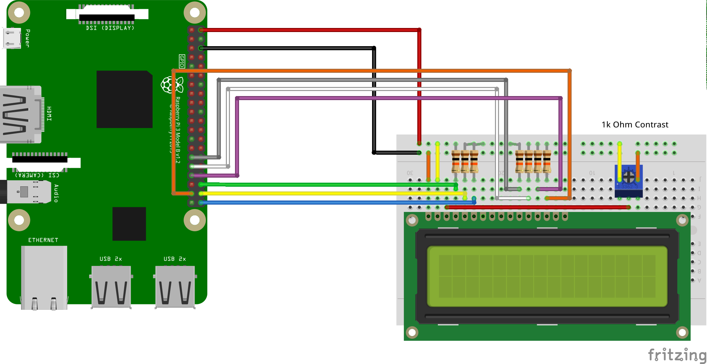
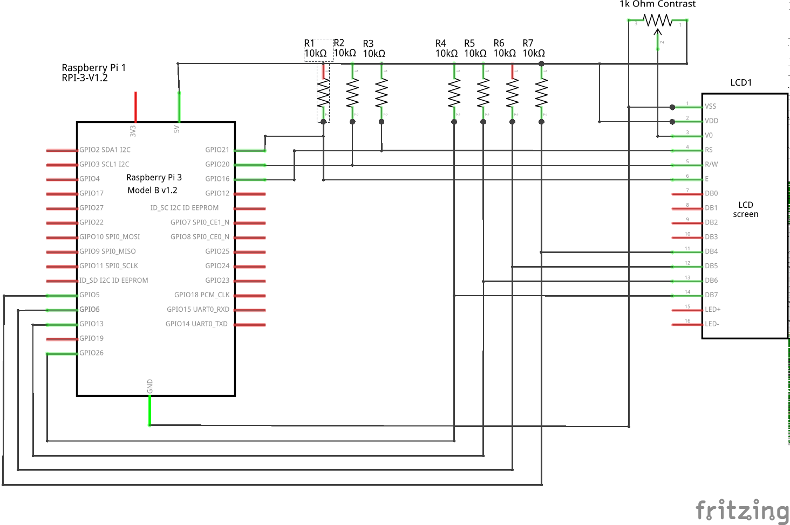

# Linux device-driver for alpanumeric HD44780 compatible displays

At first the disadvantage:
- This module consumes at least 7 GPIO connections.

Advantages:
- HD44780 compatible displays are direct contactable by the linux host-device.
  That means, no additional (active) hardware necessary. (Except some pullup resistors.)
- GPIO connections free selectable by devicetree or device-tree overlay.
- Supports all screen sizes up to the maximum of the HD44780.
- Compilable as single device-driver "anLcd.ko" or as kernel-build-in.
- Using is independend of programming-languages. That means, no extra libraries for
  user-applications necessary.
- Support of some terminal escape sequences. e.g.:
... Cursor positioning (gotoxy)
... Cursor on/off
... Clear screen
... Clear line
- Automatic terminal-like scroll-up (if desired).
- Control of reset, scroll-up and scroll-down by ioctl().
- Ability of read-back.
- Driver status readable by process file system, e.g.: "cat /proc/driver/anLcd".
- HD44780 CG-RAM for special characters programmable by ioctl();

<b>Test Setup with Raspberry Pi and 2x16 Display</b>





**Caution:**</br>
If the GPIO connectors of the Linux-device leads 3.3 volts only and the LCD-device
is built for a 5.0 volts logic, like the figures above, so you have to check whether 
the GPIO connectors withstand the 10 k Ohm pull-up resistors connected to +5.0 volts!</br>
Otherwise you risk the danger to damage the Linux-device!</br>
If you are not sure about that, so you can take a 3.3 volts to 5.0 volts
and vice-versa translator.
E.g. the IC LSF0108 resp TXB0108 from Texas Instruments.</br>
http://www.ti.com/lit/ds/symlink/lsf0108.pdf

# Compiling

Base source-code in (./src ) is also suitable for AVR-microcontroller projects
e.g. for Arduino.

**Cross-Compiling kernel-module anLcd.ko**</br>
Requirements:
- A cross-toolchain for the target-system is installed on your computer.
- The linux source-tree for your target-system is available.

Both things can you for example obtain by Buildroot or Yocto.</br>
https://buildroot.org/ </br>
https://www.yoctoproject.org/ </br>

In the Makefile there are three vareables which you have to adjust on your tool-chain:
- ```TOOLCHAIN_PATH``` path to your tool-chain.
- ```CROSS_COMPILE``` prefix for the cross-compiler.
- ```CROSS_KERNEL_SRC_DIR``` path to the root of the embedded linux source-tree.

The following code- snippet shows the current setting in the Makefile and is a
proposal for your own settings. In this case the tool-chain was build by Buildroot for the Rasberry Pi.
```
TOOLCHAIN_BASE ?= ~/src/Linux_build/buildroot_pi/output/
TOOLCHAIN_PATH ?= $(TOOLCHAIN_BASE)host/usr/bin/
CROSS_COMPILE  ?= $(TOOLCHAIN_PATH)arm-buildroot-linux-uclibcgnueabihf-
CROSS_KERNEL_SRC_DIR ?= $(shell echo $(TOOLCHAIN_BASE)/build/linux-[!h]* )
```
The makefile-variable ```TOOLCHAIN_BASE``` is just helpful, you don't need it really.</br>
When you has used Buildroot may by you have to adjust this variable only.</br>
If you'll connect the LCD on other GPIO-pins like the figure above, so you have at first
edit the file ```./ksrc/anLcd_raspi.dts```

1) Go in the sub-directory ./ksrc
2) Type ```make all``` (builds the kernel module)
3) Type ```make blob```(builds the device-tree overlay)

**load the driver**
```
sudo insmod anLcd.ko
```
After that you should have a new device-file ```anlcd``` in the folder ```/dev```</br>
If you'll make this device accessable for all users, so you can write a new
udev- rule in the folder ```/etc/udev/rules.d/```</br>

By the following steps we assumed the target-device is a Raspberry Pi:</br>


**First example**
```
echo "Hello world!" > /dev/anLcd
```
## Esc-sequences
Cursor on:
```
# printf "\e[?25h"  > /dev/anLcd
```
Cursor off:
```
# printf "\e[?25l"  > /dev/anLcd
```
Example for gotoxy(5,1):
```
# printf "\e[1;5H"  > /dev/anLcd
```
Example for clear-screen:
```
# printf "\e[H"  > /dev/anLcd
```


**IOCTL- commands**

The driver supports some ioctl-commands e.g. for the C- function ```ioctl()```.
This ioctl- commands are defined in the header- file ```./include/linux/an_disp_ioctl.h```

For quick tests or shell scripts you can use a bash variant of ioctl.

**Note:** 
This bash variant of ioctl is not a official bash-command but you can obtain this in the following repository:
https://github.com/UlrichBecker/ioctl4bash

By the process- file-system you can quickly obtain the related hex-number of
each defined ioctl- command.
```
# cat /proc/driver/anLcd 
```
```
anLcd 16x2 Version: 0.1

GPIO 16: rs = low
GPIO 20: rw = high
GPIO 21: en = low
GPIO 05: d4 = high
GPIO 06: d5 = high
GPIO 13: d6 = high
GPIO 26: d7 = high

Valid commands for ioctl():
AN_DISPLAY_IOC_RESET:   0x00006400
AN_DISPLAY_IOC_SCROLL_UP:       0x00006401
AN_DISPLAY_IOC_SCROLL_DOWN:     0x00006402
AN_DISPLAY_IOC_LOAD_DEFAULT_CGRAM:      0x00006407
AN_DISPLAY_IOC_WRITE_CGRAM:     0x40096408
AN_DISPLAY_IOC_AUTOSCROLL_ON:   0x00006403
AN_DISPLAY_IOC_AUTOSCROLL_OFF:  0x00006404
AN_DISPLAY_IOC_OFF:     0x00006406
AN_DISPLAY_IOC_ON:      0x00006405

Auto scroll: enabled
```
**Bash example for writing and displaying a self made character in CG-RAM:**
```
# printf "\x01\x01\x03\x07\x00\x00\x07\x03\x01" | ioctl -p=16 /dev/anLcd 0x40096408
# echo -e "My special: \x01"  > /dev/anLcd
```
**Note:** The first byte is the address byte of the CG-RAM (here address 0x01) followed by the 8 pattern-bytes.

**A few words about my coding style.**

Yes, I know my code is not Linux-style.
For example, I open curly braces in a new line, and don't use tabs except in makefiles.
So the code can never officially become part of the Linux kernel, which I never planned to do.
However, since I am the only author of the code so far and have maintained it alone so far,
I keep the code in a form that is most pleasing to my eyes.
